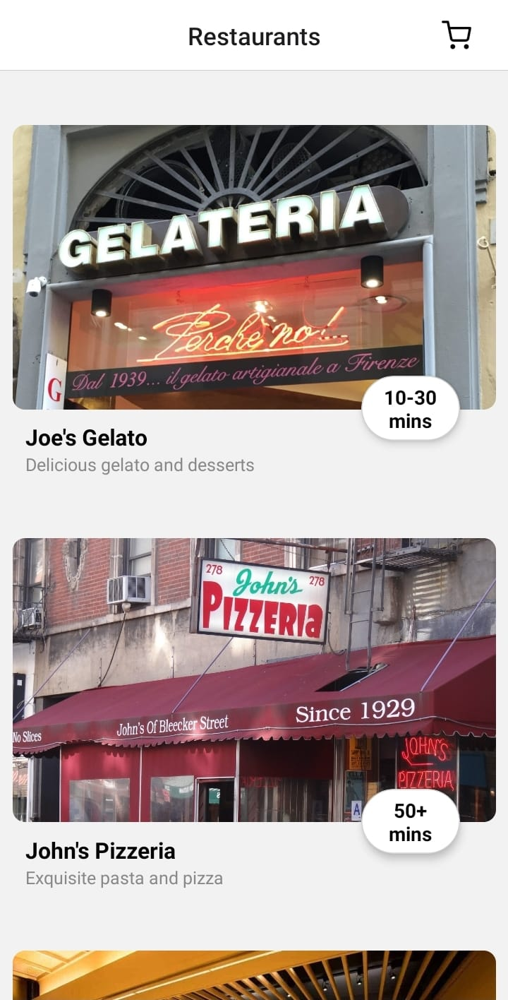
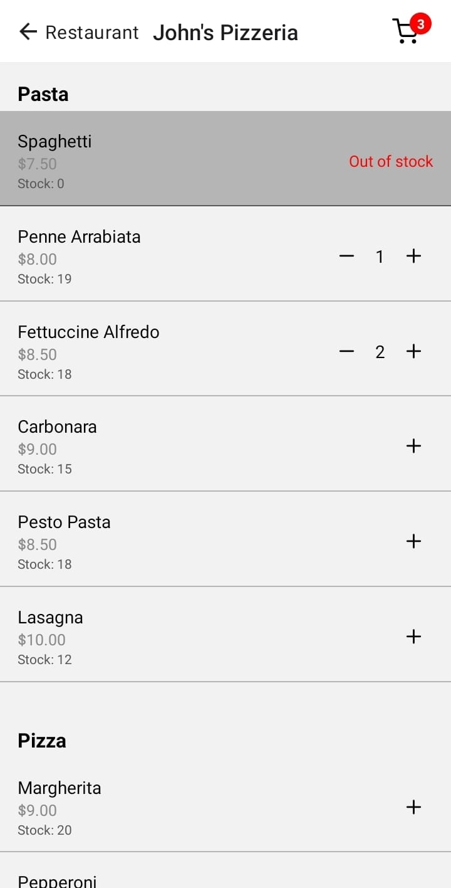
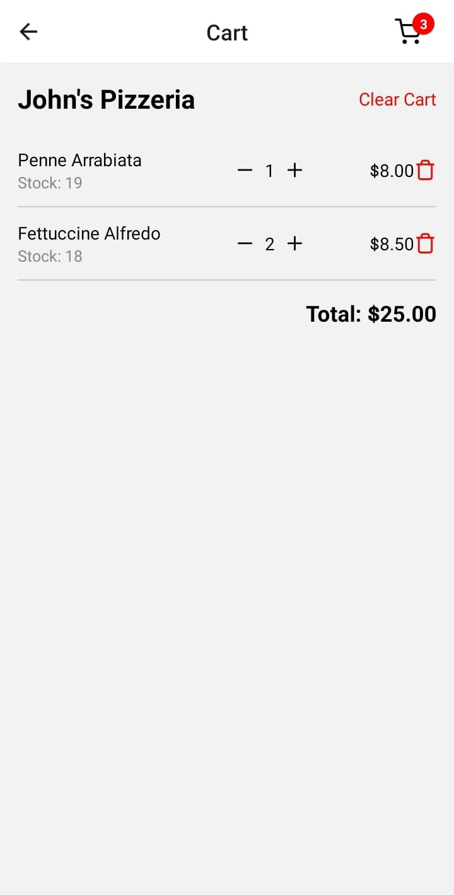

# Project Name: RNfoodApp

## Description:

RNfoodApp is a mobile application built using React Native that allows users to:

- Browse and search for restaurants
- View menu items
- Add items to cart
- View Cart

Submission for **graded assignment 4.301 (Food ordering app)**

Click on the expo snack link in the expo.txt or [click here](https://snack.expo.dev/@barnabas243/github.com-barnabas243-rnfoodapp).

## Table of Contents

- [Preview](#preview)
- [Prerequisites](#prerequisites)
- [Installation](#installation)
- [Running the App](#running-the-app)
- [License](#license)

## Preview

### Home Screen

  
### Menu Screen

  
### Cart Screen


## Prerequisites

Before running the app, make sure you have Node.js and Expo CLI installed on your machine.

- [Node.js](https://nodejs.org/)
- [Expo CLI](https://docs.expo.dev/get-started/installation/)

## Installation

1. Clone the repository and navigate to the project directory::

   ```bash
   git clone https://github.com/barnabas243/RNfoodApp.git
   cd RNfoodApp
   ```

2. Install dependencies:

   ```bash
   npm install
   ```

## Running the App

To start the app locally, use the following command:

```bash
npm start
```

or

```bash
npx expo start
```

This will open the Expo development server and provide you with options to run the app on an Android/iOS simulator or scan the QR code with the Expo Go app on your device.

## License

This project is licensed under the [MIT License](LICENSE).
